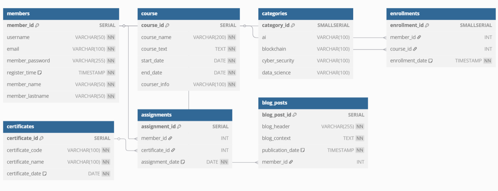

# 🎓 Eğitim Platformu - SQL Final Projesi

Bu proje, TurkStudentCo Data Science Bootcamp SQL/PostgreSQL eğitim modülü kapsamında geliştirilmiştir. Bir eğitim platformunun temel veritabanı yapısını modellemektedir.

## 🛠️ Teknolojiler

- SQL (PostgreSQL uyumlu)

## 📁 İçerik

- `members`: Kullanıcı bilgileri  
- `course`: Kurs içerikleri  
- `categories`: Kurs kategorileri  
- `enrollments`: Kurs kayıtları  
- `certificates`: Sertifikalar  
- `assignments`: Sertifika atamaları  
- `blog_posts`: Blog içerikleri  

## 🔧 Kullanım

1. PostgreSQL üzerinde `egitim_platformu_proje.sql` dosyasını çalıştırın.  
2. Veritabanı tabloları oluşturulacak ve örnek veriler eklenecektir.

## 🖼️ Veritabanı Şeması

